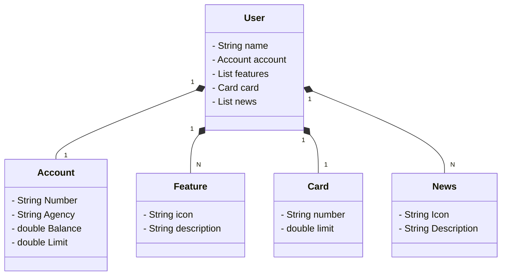

# SANTANDER-DEV-WEEK-2023
Java RESTFul API criada para a Santander Dev Week 2023

## Diagrama de Classes

```mermaid

classDiagram
  class User {
    - String name
    - Account account
    - List<Feature> features
    - Card card
    - List<News> news
  }

  class Account {
    - String Number
    - String Agency
    - double Balance
    - double Limit
  }

  class Feature {
    - String icon
    - String description
  }

  class Card {
    - String number
    - double limit
  }

  class News {
    - String Icon
    - String Description
  }

  User "1" *-- "1" Account
  User "1" *-- "N" Feature
  User "1" *-- "1" Card
  User "1" *-- "N" News

```
